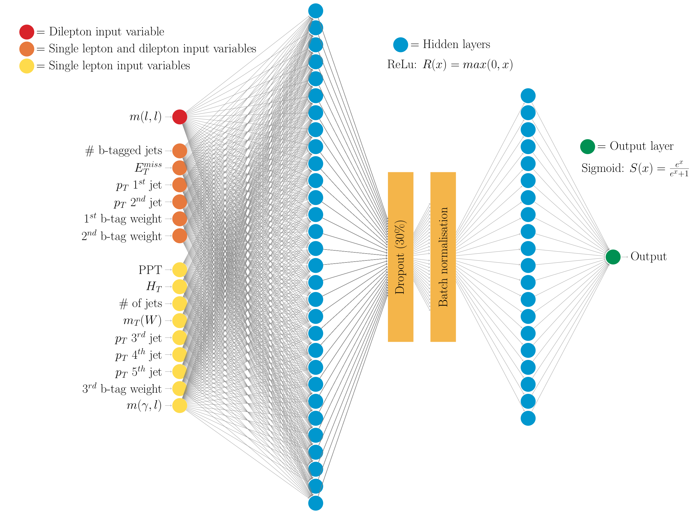

# TikzTemplates

A random collection of tikz examples I've collected over the ages.

## What's in the box?

* StandardModelBalls

* NeuralNetwork

## Contributing

Feel free to add some examples!
At the risk of this repo blowing up, please add examples  images in this README. (Tikz code is generally not easy reading, examples images are useful!)

On Mac, convert to png:
`sips -s format png image.pdf --out image.png` and add to examples above.

## Acknowledgments

* Many random threads on stackoverflow
